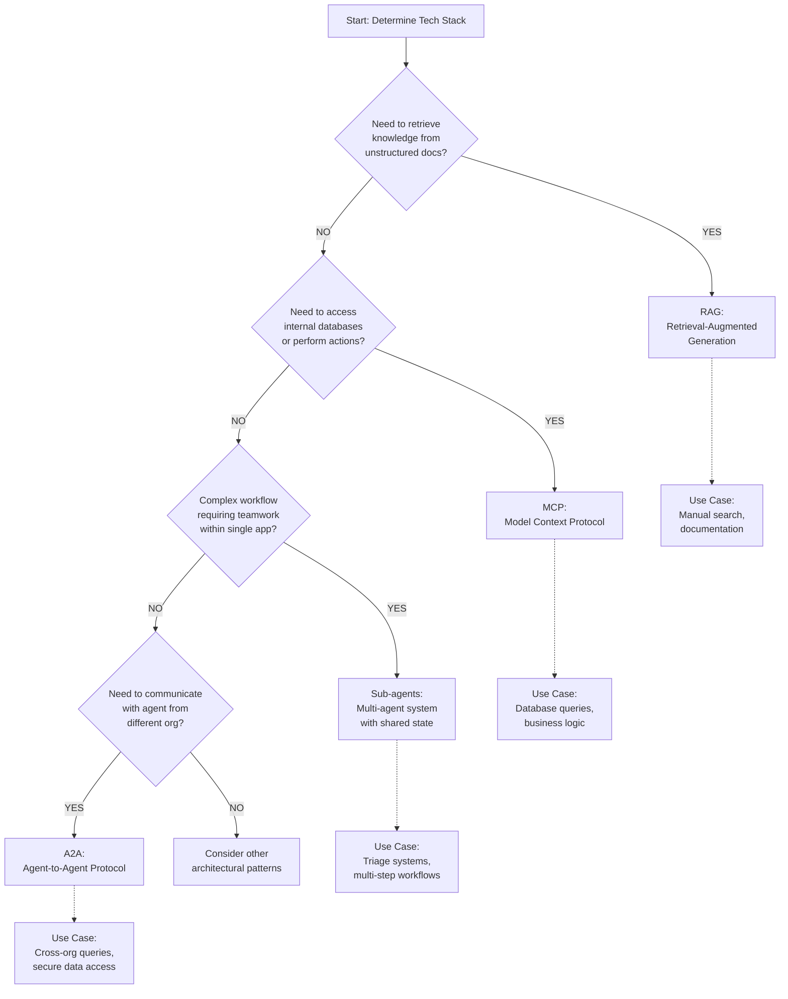
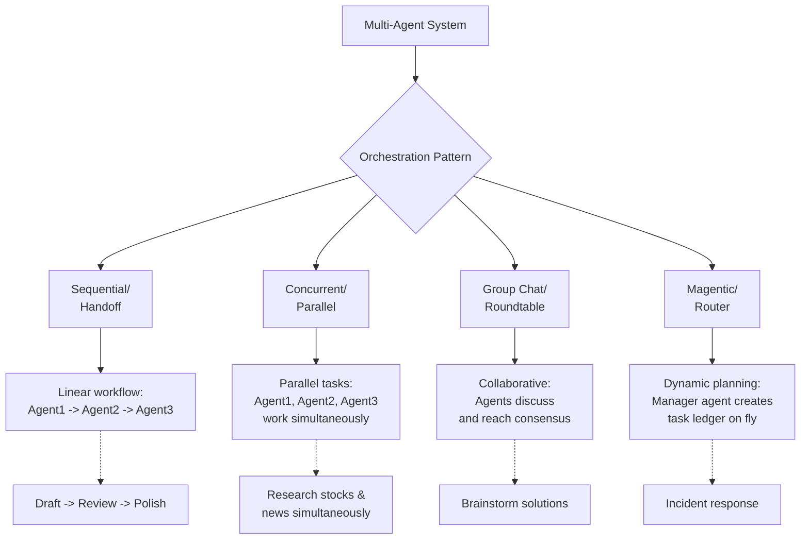
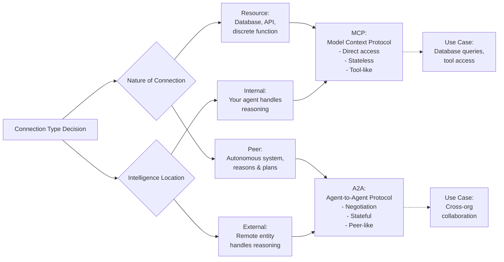
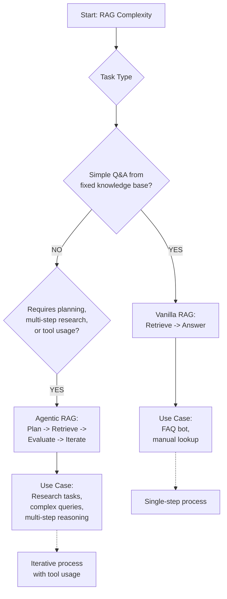
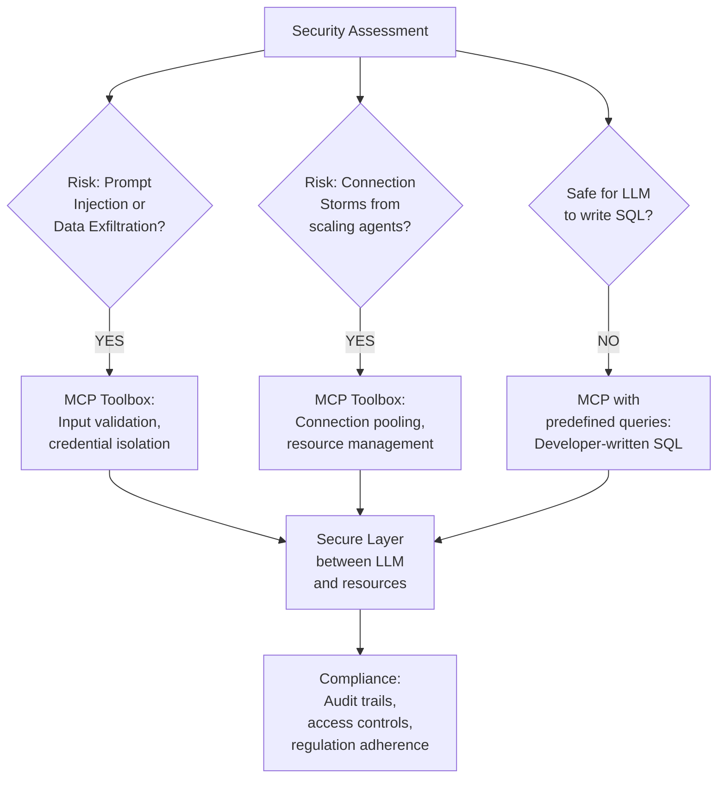

# Decision Framework for AI Architecture

This document provides a comprehensive decision framework to guide architects and developers in selecting the most appropriate patterns, protocols, and architectures for their AI systems. The framework consists of five interconnected decision trees that address different aspects of AI system design.

## Overview

The decision framework is designed to help navigate complex architectural decisions by providing structured approaches to evaluate options based on specific requirements and constraints. Each framework addresses a different aspect of AI system design:

1. [High-Level Architecture Framework](#1-high-level-architecture-framework-the-right-tool-tree)
2. [Multi-Agent Orchestration Framework](#2-multi-agent-orchestration-framework)
3. [Protocol Selection Framework](#3-protocol-selection-framework-mcp-vs-a2a)
4. [RAG Complexity Framework](#4-rag-complexity-framework)
5. [Security & Governance Framework](#5-security--governance-framework)

---

## 1. High-Level Architecture Framework (The "Right Tool" Tree)

This framework determines the fundamental technology stack for your agent based on its primary function.

### Decision Process

1. **Do you need to retrieve knowledge from a large library of unstructured documents (e.g., manuals)?**
   - **YES:** Use **RAG (Retrieval-Augmented Generation)**.
   - **NO:** Proceed to Decision 2.

2. **Do you need to access specific internal databases or perform actions (e.g., "hands" for the AI)?**
   - **YES:** Use **MCP (Model Context Protocol)**.
     - *Use Case:* Federated lookup of structured data or triggering business logic (e.g., placing an order).

3. **Is the task a complex workflow requiring teamwork within a single application?**
   - **YES:** Use **Sub-agents**.
     - *Use Case:* A triage system where one agent diagnoses and another schedules, sharing state within the same app.

4. **Does the agent need to communicate with an agent owned by a different organization/entity?**
   - **YES:** Use **A2A (Agent-to-Agent Protocol)**.
     - *Use Case:* Querying a manufacturer's database where you cannot have raw access due to privacy/security; their agent acts as an "intelligent firewall."

### Visualization

### Application

This framework should be applied early in the design process to establish the foundational architecture. It helps determine whether you need retrieval capabilities, external data access, multi-agent coordination, or inter-organizational communication.

---

## 2. Multi-Agent Orchestration Framework

Once you have decided to use multiple agents (Decision 3 above), this framework helps you select the correct interaction pattern.

### Selection Criteria

- **Sequential / Handoff Orchestration**
  - **When to use:** Process requires step-by-step refinement where the output of one agent is the input for the next.
  - **Best for:** Draft-review-polish workflows or strictly linear pipelines.

- **Concurrent / Parallel Orchestration**
  - **When to use:** Tasks can be performed independently and simultaneously to save time.
  - **Best for:** Researching multiple domains at once (e.g., one agent checks stocks, another checks news) and aggregating results.

- **Group Chat / Roundtable**
  - **When to use:** Problem requires brainstorming, debate, or consensus among diverse perspectives.
  - **Best for:** Creative ideation or complex decision-making where agents "discuss" the solution.

- **Magentic / Router Orchestration**
  - **When to use:** Solution path is unknown or open-ended, requiring dynamic planning.
  - **Best for:** Incident response or open-ended research where a "Manager" agent builds a task ledger dynamically.

### Visualization

### Considerations

When selecting an orchestration pattern, consider:
- The complexity of the task dependencies
- The need for real-time collaboration
- Performance requirements
- The degree of autonomy required by individual agents

---

## 3. Protocol Selection Framework (MCP vs. A2A)

This framework specifically addresses the confusion between connecting tools versus connecting agents.

### Connection Nature Decision

- **Connecting to a Resource:** If the connection is to a database, API, or tool that performs a discrete, stateless function.
  - **→ Use MCP.** (Think of it as "USB-C for AI applications").

- **Connecting to a Peer:** If the connection is to an autonomous system that reasons, plans, maintains state, and negotiates.
  - **→ Use A2A.** (Think of it as a collaboration protocol).

### Intelligence Location Decision

- **Internal:** If your agent handles the reasoning and just needs raw data/execution.
  - **→ Use MCP.**

- **External:** If the reasoning logic is private, proprietary, or complex and handled by the remote entity.
  - **→ Use A2A.**

### Visualization

### Security Implications

Consider the security implications of each protocol:
- MCP provides more direct control and potentially simpler security models
- A2A requires more sophisticated trust and authentication mechanisms

---

## 4. RAG Complexity Framework

This framework decides the level of sophistication needed for retrieval tasks.

### Decision Process

- **Simple Q&A from a fixed knowledge base?**
  - **YES:** Use **Vanilla RAG**.
    - *Mechanism:* Retrieve → Generate answer once.

- **Requires Reasoning:** Does the task require planning, multi-step research, or using tools to refine the search?
  - **YES:** Use **Agentic RAG**.
    - *Mechanism:* The agent plans a search, retrieves data, evaluates if it's sufficient, and potentially searches again or uses tools to process the data before answering.

### Visualization

### Complexity Indicators

Consider Agentic RAG when the task involves:
- Multi-step reasoning
- Iterative information gathering
- Complex query decomposition
- Need for tool usage during retrieval
- Verification and validation of retrieved information

---

## 5. Security & Governance Framework

This framework determines when to enforce MCP for security reasons rather than allowing direct LLM access.

### Risk Assessment

#### Risk Check 1: Prompt Injection or Data Exfiltration
- **Mitigation:** Use **MCP Toolbox** as a middle layer. It validates inputs and ensures the LLM never sees the raw database credentials.

#### Risk Check 2: Connection Storms from Scaling Agents
- **Mitigation:** Use **MCP Toolbox**. It manages connection pooling so thousands of agents don't crash the database.

#### Risk Check 3: Safe SQL Writing
- **NO:** Use **MCP**. Expose predefined, parameterized SQL queries as tools. The agent selects the tool, but the *developer* writes the safe SQL query.

### Visualization

### Governance Requirements

When implementing security measures, ensure:
- Proper audit trails for all agent interactions
- Compliance with data protection regulations
- Clear separation of duties between agents and data access
- Regular security reviews of agent permissions

---

## Integration with Existing Patterns

This decision framework integrates with the existing pattern taxonomy by:

- Providing a systematic approach to select from the categorized patterns
- Guiding the selection of appropriate levels (high-level vs. low-level) based on requirements
- Ensuring that security and governance considerations are addressed early in the design process
- Supporting the selection of appropriate diagram types (Mermaid vs. PlantUML) based on the chosen architecture

## Usage Guidelines

1. **Start Early:** Apply the High-Level Architecture Framework during initial design phases
2. **Iterate:** Revisit decisions as requirements evolve
3. **Document:** Record the rationale for each decision to support future maintenance
4. **Validate:** Ensure selected patterns align with organizational standards and constraints
5. **Review:** Conduct regular reviews to ensure continued appropriateness of architectural decisions

## Related Patterns

This framework connects to various patterns in the repository:
- Agent-Based Architecture patterns for multi-agent scenarios
- Data patterns for RAG implementations
- Security patterns for governance considerations
- Deployment patterns for operational concerns