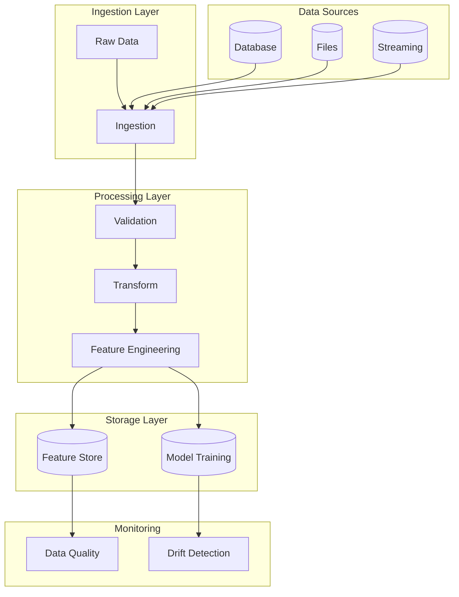
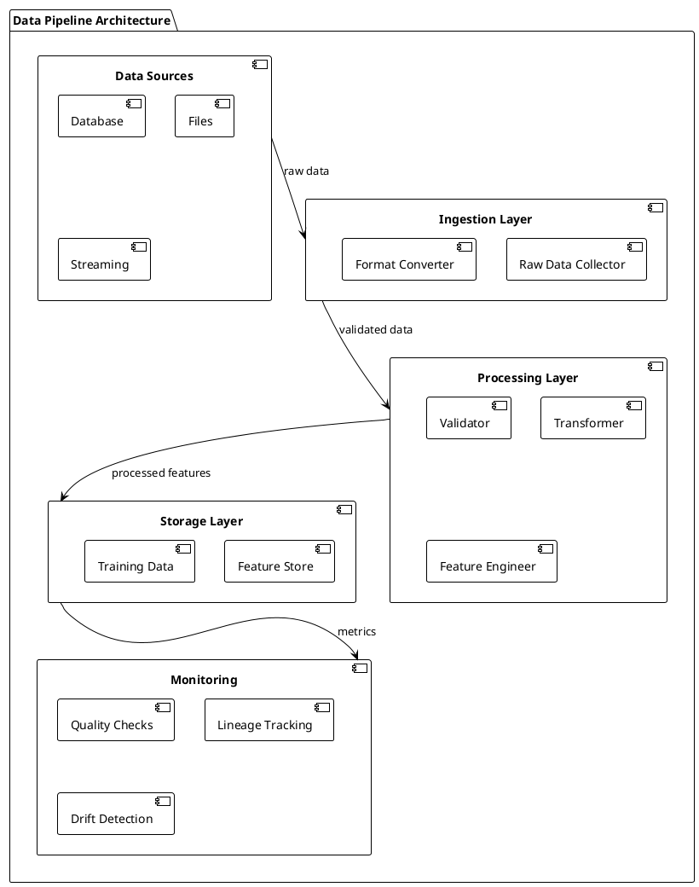

# Data Pipeline (High-level Pattern)

## Summary

Reliable data ingestion, validation, and transformation for ML systems, following modern ML pipeline architecture patterns including DAGs and stream processing.

## Problem

Raw data needs cleaning, validation, transformation, and consistent processing before ML consumption, with requirements for both batch and streaming processing.

## Context

Applies to batch and streaming data processing for training and serving, particularly in environments requiring scalable, observable, and maintainable data processing workflows.

## Solution

- Use orchestration tools (Airflow, Kubeflow, Prefect) for batch pipelines using DAGs.
- Use stream processing (Kafka Streams, Flink, Spark Streaming) for real-time processing.
- Add data quality checks, lineage tracking, and monitoring.
- Implement event-driven processing for reactive data handling.

## System Architecture Considerations

- **Microservices**: Containerize pipeline components for independent scaling and deployment.
- **Agent-Based**: Use coordination agents for complex pipeline orchestration and monitoring.
- **Event-Driven**: Implement event-driven processing where components respond to data events for improved scalability.

## ML Pipeline Architecture

- **DAGs**: Structure data workflows as Directed Acyclic Graphs with clear dependencies between ingestion, validation, transformation, and feature generation stages.
- **Shared-Nothing**: Use shared-nothing architecture for horizontally scalable processing without shared state dependencies.
- **Parameter Server/Ring-AllReduce**: For distributed data processing, consider coordinated approaches for aggregating statistics or processing results.

## Deployment Strategy

- **Batch Serving**: Suitable for scheduled ETL jobs and periodic data processing.
- **Online Serving**: For real-time data processing and feature generation.
- **Blue/Green**: For zero-downtime pipeline updates and schema changes.
- **Canary**: For gradual rollout of new processing logic to subsets of data.

## Scalability Approach

- **Horizontal**: Scale by adding more processing workers/nodes to handle increased data volume.
- **Vertical**: Increase resources (CPU, memory) for computationally intensive transformations.
- **Load Balancing**: Distribute data processing tasks across multiple workers based on data partitioning.

## Data Handling

- **Feature Store**: Integrate with feature stores to ensure consistent feature generation between training and serving.
- **Data Versioning**: Track dataset versions and lineage for reproducibility and debugging.
- **Stream Processing**: Implement real-time data ingestion and processing for online learning and feature computation.

## Model Serving

- **Model Registry**: Coordinate with model registry to ensure feature consistency across model versions.
- **Multi-Model Serving**: Support feature generation for multiple models simultaneously.
- **A/B Testing**: Generate features for multiple model variants in A/B testing scenarios.

## MLOps Integration

- **Continuous Training**: Integrate with continuous training pipelines for automated retraining based on fresh data.
- **Model Monitoring**: Monitor data quality metrics and feature distributions for drift detection.
- **Experiment Tracking**: Track data pipeline metrics alongside model performance.
- **Model Governance**: Implement data governance and compliance checks in the pipeline.

## Infrastructure Requirements

- **Distributed Systems**: Leverage distributed processing frameworks like Apache Spark or Flink.
- **GPU Resources**: Allocate GPU resources for computationally intensive data transformations.
- **Edge Deployment**: Consider edge processing for privacy-sensitive or low-latency requirements.

## Diagram (Mermaid)



## PlantUML



## Examples

Use Airflow DAGs for batch processing with data quality checks and lineage tracking:

```python
from airflow import DAG
from airflow.operators.python_operator import PythonOperator
from datetime import datetime, timedelta

def validate_data():
    # Implement data validation logic
    pass

def transform_features():
    # Implement feature transformation logic
    pass

dag = DAG(
    'data_pipeline_example',
    default_args={
        'owner': 'data-team',
        'depends_on_past': False,
        'start_date': datetime(2023, 1, 1),
        'email_on_failure': True,
        'retries': 1,
        'retry_delay': timedelta(minutes=5)
    },
    description='Example data pipeline with validation',
    schedule_interval=timedelta(hours=1),
    catchup=False
)

validate_task = PythonOperator(
    task_id='validate_data',
    python_callable=validate_data,
    dag=dag
)

transform_task = PythonOperator(
    task_id='transform_features',
    python_callable=transform_features,
    dag=dag
)

validate_task >> transform_task
```

## References

- Apache Airflow best practices
- Kafka Streams for real-time processing
- Data pipeline orchestration patterns
- Feature store architecture patterns

## Guardrails

Define the boundaries, constraints, and rules that govern the implementation and usage of data pipeline patterns to prevent misuse and ensure compliance with organizational standards. This includes defining acceptable data quality thresholds, processing time limits, and security requirements.

## Monitoring

Specify how the data pipeline implementation should be monitored, including key metrics (processing throughput, data quality scores, latency), logging requirements (data lineage, processing logs), alerting thresholds (quality score < 0.9, processing time > 1hr), and observability considerations (end-to-end data flow tracking, error correlation).

## Governance

Outline the governance aspects of data pipelines including ownership (data owners, pipeline maintainers), approval processes (schema changes, access controls), compliance requirements (GDPR, data retention), and review cycles (data quality audits, security reviews).

## Security

Detail security considerations specific to data pipelines, including threat modeling (data tampering, unauthorized access), data protection (encryption in transit/at rest, PII masking), access controls (RBAC for data access), and security validation requirements (vulnerability scanning, access audits).

## Testing

Describe the testing strategy for implementations of data pipelines, including unit tests (individual transformation functions), integration tests (end-to-end data flow), security tests (access control validation), and performance tests (throughput under load, processing latency).

## Reproducibility

Address how data pipeline implementations can be reproduced consistently across different environments, including configuration management (infrastructure as code, pipeline definitions), versioning (data schemas, transformation logic), and deployment procedures (automated pipeline deployment).

## Lifecycle

Define the lifecycle stages of data pipeline implementation, including creation (initial pipeline setup), maintenance (monitoring and updates), evolution (schema changes and feature additions), and eventual deprecation procedures (data archival and pipeline retirement).

## Delivery Checklist

A checklist of items to verify before deploying data pipeline implementations to production:

- [ ] Security requirements met
- [ ] Monitoring and alerting configured
- [ ] Documentation complete
- [ ] Testing coverage achieved
- [ ] Performance benchmarks validated
- [ ] Compliance requirements satisfied
- [ ] Rollback procedures documented
- [ ] Disaster recovery plans updated
- [ ] Architecture alignment verified
- [ ] Scalability requirements addressed
- [ ] Data handling procedures defined
- [ ] MLOps integration confirmed
- [ ] Data quality checks implemented
- [ ] Lineage tracking enabled
- [ ] Error handling and retry logic configured
