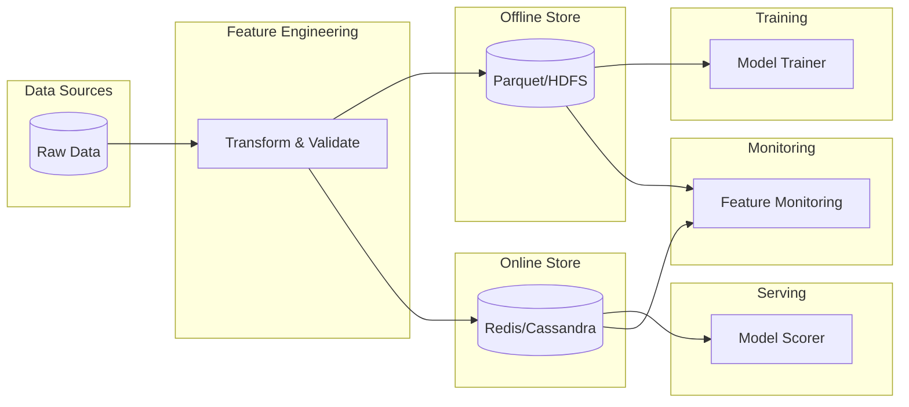
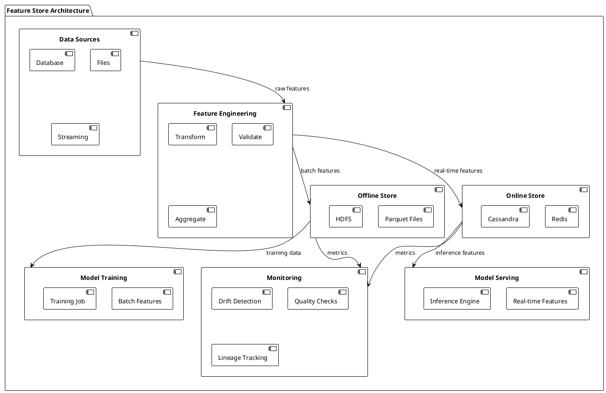

# Feature Store (High-level Pattern)

## Summary

Centralized storage and serving of features for ML training and inference, following the feature store pattern with offline and online stores for consistent feature management.

## Problem

Features computed once but needed for both training and serving with consistency, requiring versioning, reproducibility, and efficient access patterns for both batch and real-time scenarios.

## Context

Applies to systems with shared feature computation between training and serving, particularly in environments requiring consistent feature values, reproducibility, and efficient access for both batch training and real-time inference.

## Solution

- Use a feature store (Feast, Hopsworks, AWS SageMaker Feature Store).
- Separate offline store (batch, Parquet/HDFS) and online store (real-time, Redis/Cassandra).
- Add feature lineage, metadata tracking, and versioning.
- Implement data validation and quality checks.

## System Architecture Considerations

- **Microservices**: Deploy feature store as a containerized service with isolated components for reliable access and independent scaling.
- **Agent-Based**: Use coordination agents for complex feature computation orchestration and monitoring.
- **Event-Driven**: Implement event-driven feature updates for real-time feature refresh based on data changes.

## ML Pipeline Architecture

- **DAGs**: Integrate feature store operations into ML pipeline workflows with clear dependencies between feature computation, storage, and model training/deployment.
- **Shared-Nothing**: Use shared-nothing architecture for horizontally scalable feature computation without shared state dependencies.
- **Parameter Server/Ring-AllReduce**: For distributed feature computation, consider coordinated approaches for aggregating statistics or computing features.

## Deployment Strategy

- **Online Serving**: Essential for real-time inference requiring low-latency feature access (<10ms).
- **Batch Serving**: For scheduled feature computation and training data preparation.
- **Blue/Green**: For zero-downtime feature store schema updates and versioning.
- **Canary**: For gradual rollout of new features to subsets of models/users.

## Scalability Approach

- **Horizontal**: Scale by adding more feature store nodes to handle increased query volume.
- **Vertical**: Increase resources (memory, storage) for feature stores handling large feature sets.
- **Load Balancing**: Distribute feature requests across multiple store instances based on feature partitioning.

## Data Handling

- **Feature Store**: This is the core pattern - centralized repository for storing, managing, and serving features.
- **Data Versioning**: Track feature versions and lineage to ensure reproducibility and enable model retraining with historical features.
- **Stream Processing**: Implement real-time feature computation for online stores based on streaming data sources.

## Model Serving

- **Model Registry**: Integrate with model registry to ensure feature consistency across model versions and deployments.
- **Multi-Model Serving**: Support feature access for multiple models simultaneously with consistent feature values.
- **A/B Testing**: Provide consistent features for multiple model variants in A/B testing scenarios.
- **Shadow Mode**: Ensure new models receive the same features as production models for validation.

## MLOps Integration

- **Continuous Training**: Integrate with continuous training pipelines for automated feature updates based on fresh data.
- **Model Monitoring**: Monitor feature distributions and quality metrics for drift detection and model performance correlation.
- **Experiment Tracking**: Track feature usage and performance metrics alongside model experiments.
- **Model Governance**: Implement feature governance and compliance checks with audit trails.

## Infrastructure Requirements

- **Distributed Systems**: Leverage distributed storage systems for scalable feature storage and retrieval.
- **GPU Resources**: Potentially allocate GPU resources for computationally intensive feature computations.
- **Edge Deployment**: Consider edge feature stores for ultra-low latency requirements or privacy-sensitive scenarios.

## Diagram (Mermaid)



## PlantUML



## Examples

Implement feature store using Feast with offline and online stores:

```python
from feast import FeatureStore, Entity, Feature, FeatureView
from feast.infra.offline_stores.file_source import FileSource
from datetime import timedelta
import pandas as pd

# Define entities
driver = Entity(name="driver_id", description="Driver identifier")

# Define feature view
driver_stats_fv = FeatureView(
    name="driver_hourly_stats",
    entities=["driver_id"],
    features=[
        Feature(name="conv_rate", dtype=ValueType.FLOAT),
        Feature(name="acc_rate", dtype=ValueType.FLOAT),
        Feature(name="avg_daily_trips", dtype=ValueType.INT32),
    ],
    batch_source=driver_hourly_stats,
    ttl=timedelta(days=1),
)

# Apply feature view to the store
fs = FeatureStore(repo_path=".")
fs.apply([driver_stats_fv])

# Retrieve features for training
training_df = fs.get_historical_features(
    entity_df=entity_df,
    features=[
        'driver_hourly_stats:conv_rate',
        'driver_hourly_stats:acc_rate',
        'driver_hourly_stats:avg_daily_trips',
    ]
).to_df()

# Retrieve features for serving
feature_vector = fs.get_online_features(
    features=[
        'driver_hourly_stats:conv_rate',
        'driver_hourly_stats:acc_rate',
        'driver_hourly_stats:avg_daily_trips',
    ],
    entity_rows=[{"driver_id": 1234}]
).to_dict()
```

## References

- Feast documentation
- Feature store best practices
- Hopsworks feature store
- AWS SageMaker Feature Store

## Guardrails

Define the boundaries, constraints, and rules that govern the implementation and usage of feature store patterns to prevent misuse and ensure compliance with organizational standards. This includes defining acceptable feature freshness requirements, storage limits, and access controls.

## Monitoring

Specify how the feature store implementation should be monitored, including key metrics (feature retrieval latency, cache hit rates, data freshness), logging requirements (feature access logs, data quality metrics), alerting thresholds (latency > 10ms, freshness > 1hr), and observability considerations (feature lineage tracking, data drift detection).

## Governance

Outline the governance aspects of feature stores including ownership (feature owners, platform team), approval processes (feature registration, schema changes), compliance requirements (data privacy, retention), and review cycles (feature usage reviews, security audits).

## Security

Detail security considerations specific to feature stores, including threat modeling (data exfiltration, unauthorized access), data protection (encryption in transit/at rest, PII masking), access controls (RBAC for feature access), and security validation requirements (vulnerability scanning, access audits).

## Testing

Describe the testing strategy for implementations of feature stores, including unit tests (feature computation functions), integration tests (end-to-end feature retrieval), security tests (access control validation), and performance tests (concurrent access, latency under load).

## Reproducibility

Address how feature store implementations can be reproduced consistently across different environments, including configuration management (infrastructure as code, store schemas), versioning (feature definitions, data schemas), and deployment procedures (automated store provisioning).

## Lifecycle

Define the lifecycle stages of feature store implementation, including creation (initial store setup), maintenance (monitoring and updates), evolution (schema changes and feature additions), and eventual deprecation procedures (feature archival and store retirement).

## Delivery Checklist

A checklist of items to verify before deploying feature store implementations to production:

- [ ] Security requirements met
- [ ] Monitoring and alerting configured
- [ ] Documentation complete
- [ ] Testing coverage achieved
- [ ] Performance benchmarks validated
- [ ] Compliance requirements satisfied
- [ ] Rollback procedures documented
- [ ] Disaster recovery plans updated
- [ ] Architecture alignment verified
- [ ] Scalability requirements addressed
- [ ] Data handling procedures defined
- [ ] MLOps integration confirmed
- [ ] Feature consistency validated
- [ ] Online/offline store sync verified
- [ ] Data quality checks implemented
