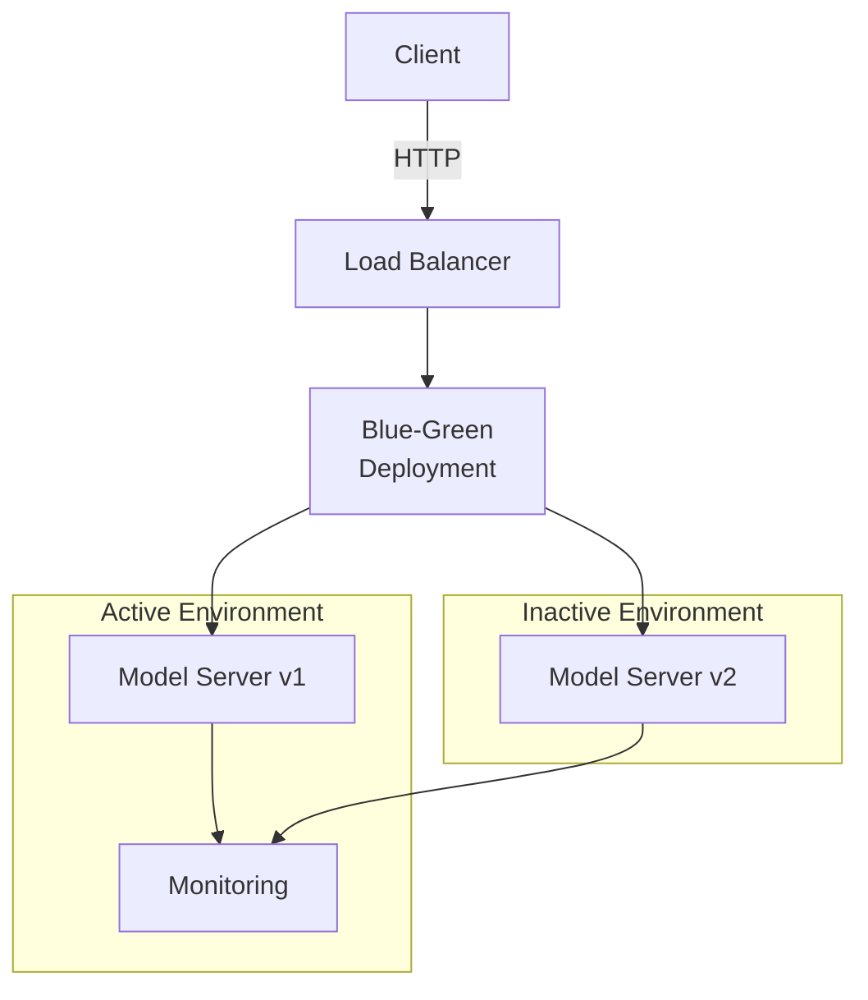

# Model Deployment (High-level Pattern)

## Summary

Strategies for safely deploying ML models to production with scalability and observability, following modern deployment patterns including blue-green and canary deployments.

## Problem

Deploying models needs low-latency inference, scaling, rollback, monitoring, and safe release strategies to minimize risk in production environments.

## Context

Applies to services that serve models to external clients or pipelines, particularly in environments requiring zero-downtime deployments and gradual rollout strategies.

## Solution

- Use a model server (e.g., TorchServe, TF-Serving, BentoML) behind a load balancer.
- Implement blue-green or canary deployment strategies for safe rollouts.
- Provide versioned model artifacts and a robust rollout strategy.
- Add comprehensive logging, metrics, and drift detection.

## System Architecture Considerations

- **Microservices**: Deploy models as containerized services with isolated components for reliable deployment and independent scaling.
- **Agent-Based**: For complex systems, consider multi-agent coordination for deployment orchestration.
- **Event-Driven**: Implement event-driven deployment triggers for automated rollouts based on model performance or data changes.

## ML Pipeline Architecture

- **DAGs**: Integrate deployment into ML pipeline workflows with clear dependencies between training, validation, and deployment stages.
- **Shared-Nothing**: Enable independent scaling of deployment infrastructure without shared state dependencies.
- **Parameter Server/Ring-AllReduce**: For distributed model serving, consider coordinated parameter management approaches.

## Deployment Strategy

- **Online Serving**: Recommended for real-time inference applications requiring low-latency responses (<100ms).
- **Batch Serving**: Suitable for non-time-critical applications like daily report generation or periodic analytics.
- **Blue/Green**: Ideal for zero-downtime deployments with instant rollback capability.
- **Canary**: Best for progressive rollout to minimize risk, starting with 5% of traffic and gradually increasing.

## Scalability Approach

- **Horizontal**: Scale by adding more model server instances behind the load balancer.
- **Vertical**: Increase resources (CPU, memory, GPU) for computationally intensive models.
- **Load Balancing**: Distribute requests across multiple model instances based on metrics like CPU utilization and queue depth.

## Data Handling

- **Feature Store**: Integrate with feature stores to ensure consistency between training and serving features.
- **Data Versioning**: Track model inputs and ensure compatibility with historical data versions.
- **Stream Processing**: For real-time models, implement stream processing for continuous feature updates.

## Model Serving

- **Model Registry**: Integrate with a model registry for versioning, metadata tracking, and lifecycle management.
- **Multi-Model Serving**: Consider serving multiple models on shared infrastructure for resource efficiency.
- **A/B Testing**: Implement traffic splitting logic to compare multiple model versions.
- **Shadow Mode**: Deploy new models alongside production models for risk-free validation.

## MLOps Integration

- **Continuous Training**: Automate retraining pipelines triggered by performance degradation or data drift.
- **Model Monitoring**: Track prediction accuracy, data drift, latency, and resource utilization.
- **Experiment Tracking**: Record model performance metrics and deployment metadata.
- **Model Governance**: Implement approval workflows and compliance documentation.

## Infrastructure Requirements

- **Distributed Systems**: Leverage container orchestration platforms like Kubernetes for deployment management.
- **GPU Resources**: Allocate specialized compute resources for models requiring GPU acceleration.
- **Edge Deployment**: Consider edge deployment for ultra-low latency requirements or offline operation.

## Diagram (Mermaid)



## PlantUML

```plantuml
@startuml
actor Client
Client -> LB: HTTP Request
LB -> DeploymentStrategy: Route
partition "Blue-Green Deployment" {
  component "Active Server v1" as ActiveServer
  component "Inactive Server v2" as InactiveServer
  component "Monitoring & Metrics" as Monitoring
}
DeploymentStrategy -> ActiveServer: Forward Request
DeploymentStrategy -> InactiveServer: Hold Ready
ActiveServer -> Monitoring: Emit Metrics
InactiveServer -> Monitoring: Emit Metrics
@enduml
```

## Examples

Include CI/CD steps to build, test, validate, and push model artifacts with blue-green or canary deployment strategies:

```yaml
# Example CI/CD pipeline with blue-green deployment
deploy:
  stage: deploy
  script:
    # Deploy to inactive environment
    - kubectl set image deployment/my-model-app container=new-image:tag --dry-run=server
    - kubectl set image deployment/my-model-app container=new-image:tag
    # Validate deployment
    - ./validate-deployment.sh
    # Switch traffic to new version
    - kubectl apply -f traffic-switch.yaml
```

## References

- Best practices for model serving
- Blue-green deployment patterns in microservices
- Canary deployment strategies for ML models

## Guardrails

Define the boundaries, constraints, and rules that govern the implementation and usage of model deployment patterns to prevent misuse and ensure compliance with organizational standards. This includes defining acceptable latency thresholds, resource limits, and security requirements.

## Monitoring

Specify how the model deployment implementation should be monitored, including key metrics (prediction latency, throughput, error rates), logging requirements (request logs, model inputs/outputs), alerting thresholds (latency > 100ms, error rate > 1%), and observability considerations (distributed tracing, model performance tracking).

## Governance

Outline the governance aspects of model deployment including ownership (model owner, platform team), approval processes (staging validation, peer review), compliance requirements (GDPR, data privacy), and review cycles (monthly performance reviews, quarterly security audits).

## Security

Detail security considerations specific to model deployment, including threat modeling (adversarial attacks, model extraction), data protection (encryption in transit/at rest), access controls (authentication/authorization for model endpoints), and security validation requirements (penetration testing, vulnerability scanning).

## Testing

Describe the testing strategy for implementations of model deployment, including unit tests (model interface validation), integration tests (end-to-end request flow), security tests (penetration testing), and performance tests (load testing, stress testing).

## Reproducibility

Address how model deployment implementations can be reproduced consistently across different environments, including configuration management (infrastructure as code), versioning (container images, model artifacts), and deployment procedures (automated deployment scripts).

## Lifecycle

Define the lifecycle stages of model deployment implementation, including creation (initial deployment), maintenance (monitoring and updates), evolution (model retraining and redeployment), and eventual deprecation procedures (graceful model retirement).

## Delivery Checklist

A checklist of items to verify before deploying model implementations to production:

- [ ] Security requirements met
- [ ] Monitoring and alerting configured
- [ ] Documentation complete
- [ ] Testing coverage achieved
- [ ] Performance benchmarks validated
- [ ] Compliance requirements satisfied
- [ ] Rollback procedures documented
- [ ] Disaster recovery plans updated
- [ ] Architecture alignment verified
- [ ] Scalability requirements addressed
- [ ] Data handling procedures defined
- [ ] MLOps integration confirmed
- [ ] Deployment strategy validated (blue-green/canary)
- [ ] Load testing completed
- [ ] Capacity planning finalized
