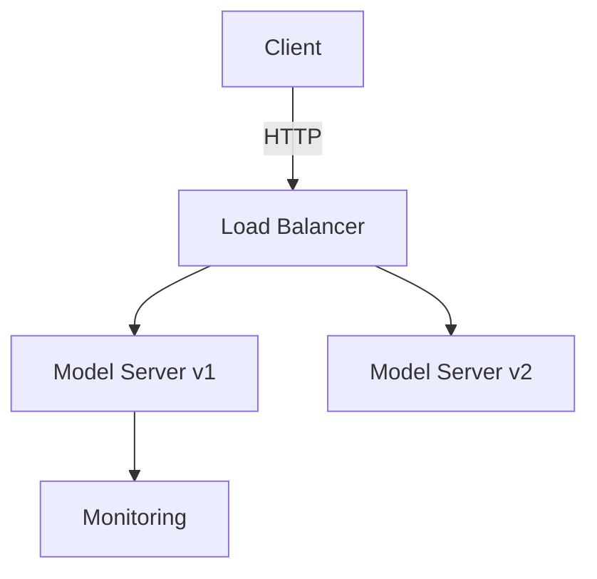
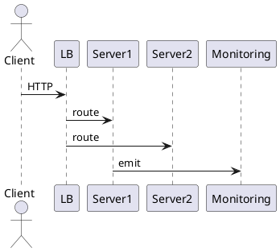

# Model Deployment (High-level Pattern)

## Summary

Strategies for safely deploying ML models to production with scalability and observability.

## Problem

Deploying models needs low-latency inference, scaling, rollback, and monitoring.

## Context

Applies to services that serve models to external clients or pipelines.

## Solution

- Use a model server (e.g., TorchServe, TF-Serving, BentoML) behind a load balancer.
- Provide versioned model artifacts and a rollout strategy (canary/blue-green).
- Add logging, metrics, and drift detection.

## Diagram (Mermaid)

## PlantUML

## Examples

Include CI steps to build, test, and push model artifacts.

## References

- Best practices for model serving
