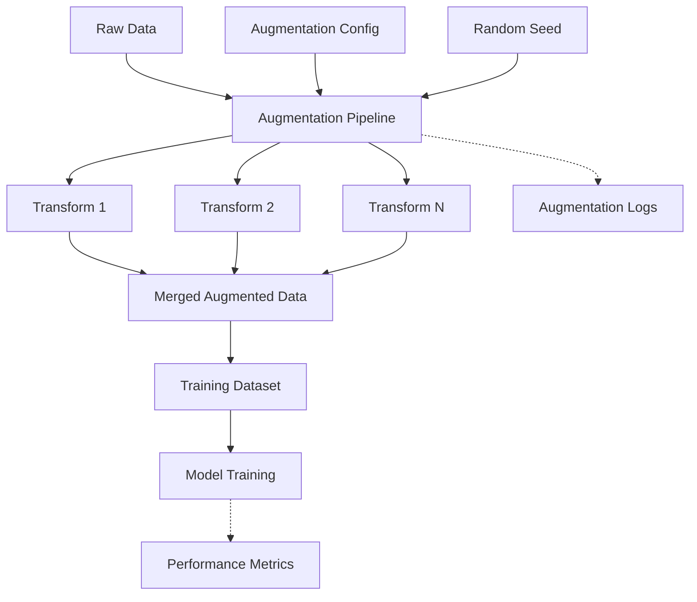
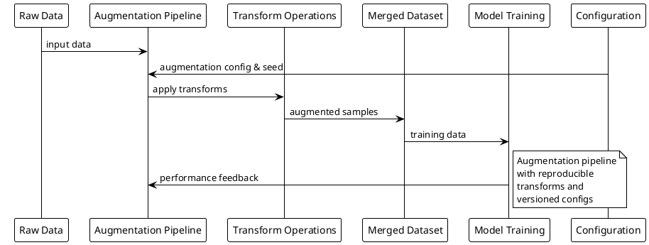

# Data Augmentation (Low-level Pattern)

## Summary

Reproducible data augmentation strategies for training stability, following data versioning and stream processing patterns for consistent feature generation.

## Problem

Training models requires diverse data to improve generalization, but augmentation must be reproducible and consistent across training runs while maintaining data integrity and avoiding overfitting to augmented patterns.

## Context

Applies to model training scenarios where limited data requires augmentation for improved generalization, particularly in computer vision, NLP, and audio processing applications where reproducibility and consistency are critical.

## Solution

- Use framework transforms (Albumentations, torchvision, imgaug) with fixed seeds for reproducibility.
- Apply augmentations during training, not during inference.
- Implement versioned augmentation pipelines for consistent application.
- Track augmentation parameters as part of experiment metadata.

## System Architecture Considerations

- **Microservices**: Containerize augmentation pipelines for consistent application across environments.
- **Agent-Based**: Use data preprocessing agents for complex augmentation orchestration.
- **Event-Driven**: Trigger augmentation pipelines based on new data availability events.

## ML Pipeline Architecture

- **DAGs**: Integrate augmentation into ML pipeline workflows with dependencies on raw data and outputting augmented datasets.
- **Shared-Nothing**: Implement distributed augmentation across multiple nodes without shared state.
- **Parameter Server/Ring-AllReduce**: For distributed augmentation, coordinate parameter sharing for consistent augmentation strategies.

## Deployment Strategy

- **Batch Serving**: Augmentation typically applied during batch data preprocessing.
- **Blue/Green**: For augmentation pipeline updates, use blue-green deployments to ensure consistency.
- **Canary**: Gradually roll out new augmentation strategies to subsets of data.

## Scalability Approach

- **Horizontal**: Scale augmentation by distributing across multiple worker nodes/processes.
- **Vertical**: Increase resources (CPU, memory) for computationally intensive augmentations.
- **Load Balancing**: Distribute augmentation tasks across available resources based on computational complexity.

## Data Handling

- **Feature Store**: For tabular data, consider augmentation as part of feature engineering pipelines.
- **Data Versioning**: Track augmentation parameters and versions to ensure reproducibility.
- **Stream Processing**: For real-time augmentation, implement streaming augmentation pipelines.

## Model Serving

- **Model Registry**: Include augmentation parameters in model metadata for serving consistency.
- **Multi-Model Serving**: Support different augmentation strategies for multiple model variants.
- **A/B Testing**: Implement consistent augmentation for models in A/B testing scenarios.

## MLOps Integration

- **Continuous Training**: Integrate augmentation into continuous training pipelines with versioned strategies.
- **Model Monitoring**: Monitor the impact of augmentation on model performance and generalization.
- **Experiment Tracking**: Track augmentation parameters and their impact on model performance.
- **Model Governance**: Document augmentation strategies for compliance and reproducibility.

## Infrastructure Requirements

- **Distributed Systems**: Leverage distributed processing frameworks for large-scale augmentation.
- **GPU Resources**: Utilize GPU acceleration for computationally intensive augmentations.
- **Edge Deployment**: Consider edge augmentation for privacy-sensitive or low-latency scenarios.

## Diagram (Mermaid)



## PlantUML



## Examples

Implement reproducible data augmentation with version tracking:

```python
import albumentations as A
from albumentations.pytorch import ToTensorV2
import cv2
import json
import hashlib
from datetime import datetime

class ReproducibleAugmentation:
    def __init__(self, config_path=None):
        """
        Initialize augmentation pipeline with reproducible settings.
        
        Args:
            config_path: Path to augmentation configuration file
        """
        if config_path:
            with open(config_path, 'r') as f:
                self.config = json.load(f)
        else:
            # Default configuration
            self.config = {
                "seed": 42,
                "transforms": [
                    {"name": "HorizontalFlip", "params": {"p": 0.5}},
                    {"name": "ShiftScaleRotate", "params": {"shift_limit": 0.1, "scale_limit": 0.1, "rotate_limit": 15, "p": 0.5}},
                    {"name": "RandomBrightnessContrast", "params": {"brightness_limit": 0.2, "contrast_limit": 0.2, "p": 0.3}},
                    {"name": "RGBShift", "params": {"r_shift_limit": 20, "g_shift_limit": 20, "b_shift_limit": 20, "p": 0.3}}
                ]
            }
        
        # Create augmentation pipeline
        self.transform = self._create_transform_pipeline()
        
        # Generate unique identifier for this augmentation configuration
        config_str = json.dumps(self.config, sort_keys=True)
        self.augmentation_id = hashlib.sha256(config_str.encode()).hexdigest()[:16]
        
    def _create_transform_pipeline(self):
        """Create the augmentation pipeline from configuration."""
        transforms_list = []
        
        for transform_config in self.config["transforms"]:
            transform_name = transform_config["name"]
            transform_params = transform_config["params"]
            
            # Get the transform class from albumentations
            transform_class = getattr(A, transform_name)
            transforms_list.append(transform_class(**transform_params))
        
        # Add normalization and tensor conversion
        transforms_list.extend([
            A.Normalize(mean=[0.485, 0.456, 0.406], std=[0.229, 0.224, 0.225]),
            ToTensorV2()
        ])
        
        return A.Compose(transforms_list)
    
    def augment(self, image):
        """
        Apply augmentation to a single image.
        
        Args:
            image: Input image array
            
        Returns:
            Augmented image
        """
        # Set random seed for reproducibility
        transformed = self.transform(image=image)
        return transformed['image']
    
    def get_augmentation_metadata(self):
        """Get metadata about this augmentation pipeline."""
        return {
            "augmentation_id": self.augmentation_id,
            "config": self.config,
            "timestamp": datetime.utcnow().isoformat(),
            "library_version": A.__version__
        }

# Usage example
def create_augmented_dataset(raw_images, labels, config_path=None):
    """
    Create an augmented dataset with reproducible augmentations.
    
    Args:
        raw_images: List of raw images
        labels: Corresponding labels
        config_path: Path to augmentation configuration
        
    Returns:
        Tuple of (augmented_images, augmented_labels)
    """
    augmenter = ReproducibleAugmentation(config_path)
    
    # Log augmentation metadata
    metadata = augmenter.get_augmentation_metadata()
    print(f"Using augmentation pipeline: {metadata['augmentation_id']}")
    
    augmented_images = []
    augmented_labels = []
    
    for image, label in zip(raw_images, labels):
        # Apply augmentation
        aug_img = augmenter.augment(image)
        
        # Store both original and augmented
        augmented_images.extend([image, aug_img])  # Original + augmented
        augmented_labels.extend([label, label])    # Same label for both
    
    return augmented_images, augmented_labels

# Example of saving augmentation config for reproducibility
aug_config = {
    "seed": 42,
    "transforms": [
        {"name": "HorizontalFlip", "params": {"p": 0.5}},
        {"name": "GaussianBlur", "params": {"blur_limit": [3, 7], "p": 0.1}},
        {"name": "RandomBrightnessContrast", "params": {"brightness_limit": 0.2, "contrast_limit": 0.2, "p": 0.3}}
    ]
}

with open("augmentation_config.json", "w") as f:
    json.dump(aug_config, f, indent=2)
```

## References

- Albumentations documentation
- torchvision transforms
- Data augmentation best practices
- Reproducible ML techniques

## Guardrails

Define the boundaries, constraints, and rules that govern the implementation and usage of data augmentation patterns to prevent misuse and ensure compliance with organizational standards. This includes defining acceptable augmentation intensity levels, preserving data meaning, and avoiding data leakage between train/validation sets.

## Monitoring

Specify how the data augmentation implementation should be monitored, including key metrics (augmentation diversity, computational overhead), logging requirements (augmentation parameters applied), alerting thresholds (excessive augmentation time, parameter drift), and observability considerations (augmentation effectiveness on model performance).

## Governance

Outline the governance aspects of data augmentation including ownership (data scientists, ML engineers), approval processes (augmentation strategy validation), compliance requirements (data privacy preservation), and review cycles (augmentation effectiveness reviews).

## Security

Detail security considerations specific to data augmentation, including threat modeling (adversarial augmentation, data poisoning), data protection (preserving privacy during augmentation), access controls (authorized augmentation parameters), and security validation requirements (checking for data leakage).

## Testing

Describe the testing strategy for implementations of data augmentation, including unit tests (individual augmentation functions), integration tests (end-to-end augmentation pipeline), security tests (privacy preservation validation), and performance tests (augmentation speed, memory usage).

## Reproducibility

Address how data augmentation implementations can be reproduced consistently across different environments, including configuration management (augmentation parameter files), versioning (library versions, random seeds), and augmentation procedures (deterministic augmentation sequences).

## Lifecycle

Define the lifecycle stages of data augmentation implementation, including creation (initial augmentation strategy), maintenance (monitoring and updates), evolution (strategy improvements based on performance), and eventual deprecation procedures (updating to new augmentation methods).

## Delivery Checklist

A checklist of items to verify before deploying data augmentation implementations to production:

- [ ] Security requirements met
- [ ] Monitoring and alerting configured
- [ ] Documentation complete
- [ ] Testing coverage achieved
- [ ] Performance benchmarks validated
- [ ] Compliance requirements satisfied
- [ ] Rollback procedures documented
- [ ] Disaster recovery plans updated
- [ ] Architecture alignment verified
- [ ] Scalability requirements addressed
- [ ] Data handling procedures defined
- [ ] MLOps integration confirmed
- [ ] Reproducibility validated
- [ ] Augmentation effectiveness measured
- [ ] Data leakage prevention verified
