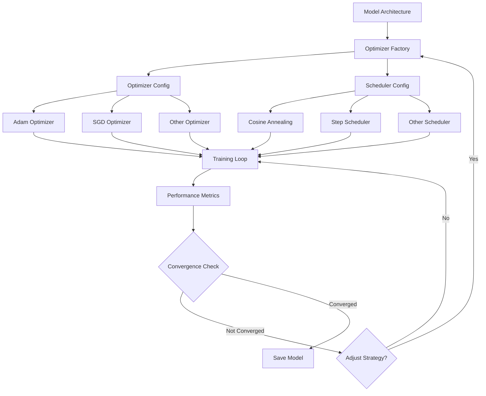
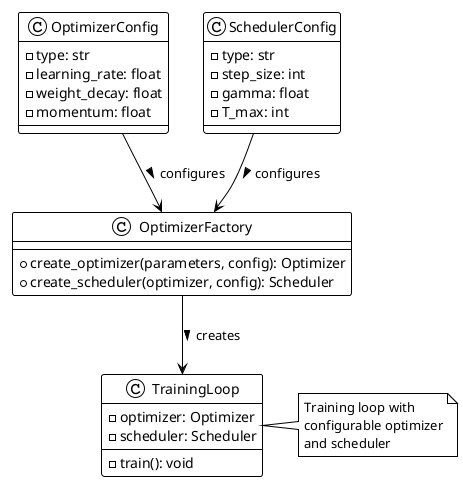

# Optimizer Pattern (Low-level Pattern)

## Summary

Factory patterns for optimizer and scheduler configuration, following MLOps patterns for experiment tracking and reproducible training configurations.

## Problem

Training models requires flexible optimizer configurations that can be easily modified, tracked, and reproduced across different experiments while maintaining consistency and enabling systematic experimentation with different optimization strategies.

## Context

Applies to model training scenarios where different optimization strategies need to be tested, compared, and tracked systematically, particularly in research and experimentation environments where reproducibility and configuration management are critical.

## Solution

- Use factory functions to instantiate optimizers with consistent configuration.
- Implement configurable optimizer and scheduler combinations.
- Track optimizer parameters as part of experiment metadata.
- Support multiple optimization strategies for different model architectures.

## System Architecture Considerations

- **Microservices**: Containerize training jobs with specific optimizer configurations for reproducibility.
- **Agent-Based**: Use training coordinator agents that manage optimizer selection and hyperparameter tuning.
- **Event-Driven**: Trigger optimizer adjustments based on performance metrics or training plateaus.

## ML Pipeline Architecture

- **DAGs**: Integrate optimizer configuration into ML pipeline workflows with dependencies on model architecture and training data.
- **Parameter Server**: For distributed optimization, coordinate parameter updates across nodes with consistent optimizer states.
- **Ring-AllReduce**: For distributed training, ensure consistent optimizer state synchronization across nodes.

## Deployment Strategy

- **Batch Serving**: Optimizer configuration primarily affects training, not serving.
- **Blue/Green**: For training pipeline updates, use blue-green deployments to test different optimization strategies.
- **Canary**: Gradually roll out new optimizer configurations to subsets of models.

## Scalability Approach

- **Horizontal**: Scale optimization by distributing across multiple GPUs/nodes with synchronized optimizer states.
- **Vertical**: Increase resources for optimizers requiring more memory (e.g., Adam with large models).
- **Load Balancing**: Distribute optimization tasks across available compute resources.

## Data Handling

- **Feature Store**: For meta-learning scenarios, consider optimizer adaptation based on feature characteristics.
- **Data Versioning**: Track optimizer configurations with data versions for reproducibility.
- **Stream Processing**: For online learning, implement adaptive optimizers that adjust to streaming data.

## Model Serving

- **Model Registry**: Include optimizer parameters in model metadata for training reproducibility.
- **Multi-Model Serving**: Support different optimization strategies for multiple model variants.
- **A/B Testing**: Train models with different optimizers for A/B testing scenarios.

## MLOps Integration

- **Continuous Training**: Automate optimizer selection based on model performance and data characteristics.
- **Model Monitoring**: Monitor optimizer performance metrics and convergence behavior.
- **Experiment Tracking**: Systematically record optimizer configurations and their impact on model performance.
- **Model Governance**: Document optimization strategies for compliance and reproducibility.

## Infrastructure Requirements

- **Distributed Systems**: Leverage distributed optimization frameworks like ZeRO or ShardedDDP.
- **GPU Resources**: Allocate sufficient memory for optimizers with state (e.g., Adam, RMSprop).
- **Edge Deployment**: Consider lightweight optimizers for edge training scenarios.

## Diagram (Mermaid)



## PlantUML



## Examples

Implement a flexible optimizer factory with experiment tracking:

```python
import torch
import torch.optim as optim
from torch.optim.lr_scheduler import *
import json
import hashlib
from datetime import datetime

class OptimizerFactory:
    """Factory class for creating optimizers and schedulers with experiment tracking."""
    
    OPTIMIZERS = {
        'adam': optim.Adam,
        'adamw': optim.AdamW,
        'sgd': optim.SGD,
        'rmsprop': optim.RMSprop,
        'adagrad': optim.Adagrad,
        'adadelta': optim.Adadelta,
    }
    
    SCHEDULERS = {
        'step': StepLR,
        'cosine': CosineAnnealingLR,
        'exponential': ExponentialLR,
        'plateau': ReduceLROnPlateau,
        'multi_step': MultiStepLR,
        'cyclic': CyclicLR,
    }
    
    def __init__(self, config_path=None):
        """
        Initialize the optimizer factory with configuration.
        
        Args:
            config_path: Path to optimizer configuration file
        """
        if config_path:
            with open(config_path, 'r') as f:
                self.config = json.load(f)
        else:
            # Default configuration
            self.config = {
                "optimizer": {
                    "type": "adam",
                    "params": {
                        "lr": 0.001,
                        "weight_decay": 0.01,
                        "betas": [0.9, 0.999]
                    }
                },
                "scheduler": {
                    "type": "step",
                    "params": {
                        "step_size": 10,
                        "gamma": 0.1
                    }
                }
            }
        
        # Generate unique identifier for this configuration
        config_str = json.dumps(self.config, sort_keys=True)
        self.config_id = hashlib.sha256(config_str.encode()).hexdigest()[:16]
    
    def create_optimizer(self, model_parameters):
        """
        Create an optimizer based on the configuration.
        
        Args:
            model_parameters: Model parameters to optimize
            
        Returns:
            Configured optimizer
        """
        opt_config = self.config["optimizer"]
        opt_type = opt_config["type"]
        opt_params = opt_config["params"]
        
        if opt_type not in self.OPTIMIZERS:
            raise ValueError(f"Unknown optimizer type: {opt_type}")
        
        optimizer_class = self.OPTIMIZERS[opt_type]
        return optimizer_class(model_parameters, **opt_params)
    
    def create_scheduler(self, optimizer):
        """
        Create a scheduler based on the configuration.
        
        Args:
            optimizer: The optimizer to schedule
            
        Returns:
            Configured scheduler
        """
        sched_config = self.config.get("scheduler")
        if sched_config is None:
            return None
            
        sched_type = sched_config["type"]
        sched_params = sched_config["params"]
        
        if sched_type not in self.SCHEDULERS:
            raise ValueError(f"Unknown scheduler type: {sched_type}")
        
        scheduler_class = self.SCHEDULERS[sched_type]
        return scheduler_class(optimizer, **sched_params)
    
    def get_config_metadata(self):
        """Get metadata about this optimizer configuration."""
        return {
            "config_id": self.config_id,
            "config": self.config,
            "timestamp": datetime.utcnow().isoformat(),
            "torch_version": torch.__version__
        }

# Advanced training loop with configurable optimizer
class ConfigurableTrainingLoop:
    def __init__(self, model, train_loader, val_loader, config_path=None):
        self.model = model
        self.train_loader = train_loader
        self.val_loader = val_loader
        
        # Create optimizer and scheduler using factory
        self.factory = OptimizerFactory(config_path)
        self.optimizer = self.factory.create_optimizer(model.parameters())
        self.scheduler = self.factory.create_scheduler(self.optimizer)
        
        # Get configuration metadata
        self.metadata = self.factory.get_config_metadata()
        print(f"Using optimizer config: {self.metadata['config_id']}")
    
    def train_epoch(self):
        self.model.train()
        total_loss = 0
        
        for batch_idx, (data, target) in enumerate(self.train_loader):
            self.optimizer.zero_grad()
            output = self.model(data)
            loss = torch.nn.functional.cross_entropy(output, target)
            loss.backward()
            self.optimizer.step()
            
            total_loss += loss.item()
        
        return total_loss / len(self.train_loader)
    
    def validate(self):
        self.model.eval()
        val_loss = 0
        
        with torch.no_grad():
            for data, target in self.val_loader:
                output = self.model(data)
                val_loss += torch.nn.functional.cross_entropy(output, target).item()
        
        return val_loss / len(self.val_loader)
    
    def train(self, num_epochs):
        for epoch in range(num_epochs):
            train_loss = self.train_epoch()
            val_loss = self.validate()
            
            print(f"Epoch {epoch}: Train Loss: {train_loss:.4f}, Val Loss: {val_loss:.4f}")
            
            # Step scheduler if available
            if self.scheduler:
                if isinstance(self.scheduler, ReduceLROnPlateau):
                    self.scheduler.step(val_loss)
                else:
                    self.scheduler.step()
            
            # Log learning rate
            current_lr = self.optimizer.param_groups[0]['lr']
            print(f"Learning Rate: {current_lr}")

# Configuration example
optim_config = {
    "optimizer": {
        "type": "adamw",
        "params": {
            "lr": 0.001,
            "weight_decay": 0.01,
            "betas": [0.9, 0.999]
        }
    },
    "scheduler": {
        "type": "cosine",
        "params": {
            "T_max": 50,
            "eta_min": 1e-6
        }
    }
}

with open("optimizer_config.json", "w") as f:
    json.dump(optim_config, f, indent=2)
```

## References

- PyTorch optimizer documentation
- Learning rate scheduling best practices
- Adaptive optimization algorithms
- Distributed optimization techniques

## Guardrails

Define the boundaries, constraints, and rules that govern the implementation and usage of optimizer patterns to prevent misuse and ensure compliance with organizational standards. This includes defining acceptable learning rate ranges, optimizer types for specific model architectures, and memory usage limits.

## Monitoring

Specify how the optimizer implementation should be monitored, including key metrics (learning rate, gradient norms, convergence speed), logging requirements (optimizer state, parameter updates), alerting thresholds (divergence, slow convergence), and observability considerations (optimizer effectiveness across different models).

## Governance

Outline the governance aspects of optimizers including ownership (ML researchers, engineers), approval processes (optimizer selection for production models), compliance requirements (fairness in optimization), and review cycles (optimizer performance reviews).

## Security

Detail security considerations specific to optimizers, including threat modeling (adversarial optimization, gradient manipulation), data protection (optimizer state security), access controls (authorized optimizer configurations), and security validation requirements (checking for optimization vulnerabilities).

## Testing

Describe the testing strategy for implementations of optimizers, including unit tests (individual optimizer functions), integration tests (end-to-end training with optimizers), security tests (gradient manipulation resistance), and performance tests (convergence speed, memory usage).

## Reproducibility

Address how optimizer implementations can be reproduced consistently across different environments, including configuration management (optimizer parameter files), versioning (library versions, algorithm implementations), and training procedures (random seed management for optimizer initialization).

## Lifecycle

Define the lifecycle stages of optimizer implementation, including creation (initial optimizer selection), maintenance (monitoring and updates), evolution (algorithm improvements and hyperparameter tuning), and eventual deprecation procedures (switching to newer optimization methods).

## Delivery Checklist

A checklist of items to verify before deploying optimizer implementations to production:

- [ ] Security requirements met
- [ ] Monitoring and alerting configured
- [ ] Documentation complete
- [ ] Testing coverage achieved
- [ ] Performance benchmarks validated
- [ ] Compliance requirements satisfied
- [ ] Rollback procedures documented
- [ ] Disaster recovery plans updated
- [ ] Architecture alignment verified
- [ ] Scalability requirements addressed
- [ ] Data handling procedures defined
- [ ] MLOps integration confirmed
- [ ] Convergence properties validated
- [ ] Memory usage optimized
- [ ] Distributed optimization verified
