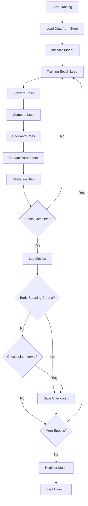
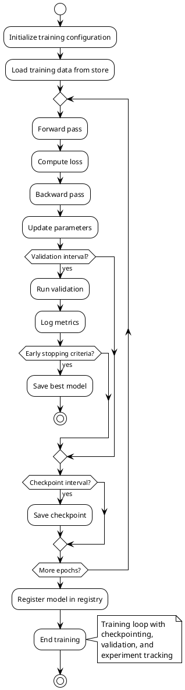

# Training Loop (Low-level Pattern)

## Summary

Robust training loops with checkpointing, logging, and early stopping, following MLOps patterns for continuous training and experiment tracking.

## Problem

Training models requires robust loops that handle failures, track experiments, manage resources efficiently, and support reproducibility across different environments.

## Context

Applies to model training scenarios where reliability, reproducibility, and experiment tracking are critical, particularly in distributed training environments and continuous training pipelines.

## Solution

- Use frameworks like PyTorch Lightning or Keras for structured training.
- Add checkpointing, logging, and experiment tracking.
- Implement early stopping and learning rate scheduling.
- Include validation loops and metric reporting.

## System Architecture Considerations

- **Microservices**: Containerize training jobs for resource isolation and independent scaling.
- **Agent-Based**: Use training coordinator agents for distributed training orchestration.
- **Event-Driven**: Trigger training jobs based on data availability or performance degradation events.

## ML Pipeline Architecture

- **DAGs**: Integrate training loops into ML pipeline workflows with dependencies on data preprocessing and validation.
- **Parameter Server**: For distributed training, coordinate parameter updates across nodes.
- **Ring-AllReduce**: For efficient gradient aggregation in distributed training setups.

## Deployment Strategy

- **Batch Serving**: Training jobs typically run as batch processes.
- **Blue/Green**: For model training pipeline updates, use blue-green deployments of training infrastructure.
- **Canary**: Gradually roll out new training configurations to subsets of models.

## Scalability Approach

- **Horizontal**: Scale training by distributing across multiple GPUs/nodes using data or model parallelism.
- **Vertical**: Increase resources (GPU memory, compute power) for larger models.
- **Load Balancing**: Distribute training jobs across available GPU resources.

## Data Handling

- **Feature Store**: Integrate with feature stores to ensure consistent training data.
- **Data Versioning**: Track training data versions for reproducibility.
- **Stream Processing**: For continuous training, process streaming data for incremental updates.

## Model Serving

- **Model Registry**: Register trained models in a model registry for versioning and lifecycle management.
- **Multi-Model Serving**: Train multiple model variants simultaneously for A/B testing.
- **A/B Testing**: Train models optimized for different objectives for A/B testing scenarios.

## MLOps Integration

- **Continuous Training**: Automate retraining pipelines triggered by data drift or performance degradation.
- **Model Monitoring**: Monitor training metrics and detect anomalies during training.
- **Experiment Tracking**: Systematically record hyperparameters, metrics, and artifacts.
- **Model Governance**: Implement approval workflows for trained models before deployment.

## Infrastructure Requirements

- **Distributed Systems**: Leverage distributed training frameworks like Horovod or DeepSpeed.
- **GPU Resources**: Allocate specialized GPU resources for computationally intensive training.
- **Edge Deployment**: Generally not applicable for training, but consider edge training for federated learning.

## Diagram (Mermaid)



## PlantUML



## Examples

Implement a robust training loop with experiment tracking:

```python
import torch
import torch.nn as nn
from torch.utils.data import DataLoader
import mlflow
import os

class TrainingLoop:
    def __init__(self, model, train_loader, val_loader, optimizer, criterion, device):
        self.model = model.to(device)
        self.train_loader = train_loader
        self.val_loader = val_loader
        self.optimizer = optimizer
        self.criterion = criterion
        self.device = device
        self.best_val_loss = float('inf')
        self.patience_counter = 0
        
    def train_epoch(self):
        self.model.train()
        total_loss = 0
        for batch_idx, (data, target) in enumerate(self.train_loader):
            data, target = data.to(self.device), target.to(self.device)
            
            self.optimizer.zero_grad()
            output = self.model(data)
            loss = self.criterion(output, target)
            loss.backward()
            self.optimizer.step()
            
            total_loss += loss.item()
            
            # Log metrics periodically
            if batch_idx % 100 == 0:
                mlflow.log_metric("train_batch_loss", loss.item(), step=batch_idx)
                
        return total_loss / len(self.train_loader)
    
    def validate(self):
        self.model.eval()
        val_loss = 0
        with torch.no_grad():
            for data, target in self.val_loader:
                data, target = data.to(self.device), target.to(self.device)
                output = self.model(data)
                val_loss += self.criterion(output, target).item()
                
        avg_val_loss = val_loss / len(self.val_loader)
        return avg_val_loss
    
    def train(self, num_epochs, patience=5, checkpoint_dir="./checkpoints"):
        os.makedirs(checkpoint_dir, exist_ok=True)
        
        for epoch in range(num_epochs):
            train_loss = self.train_epoch()
            val_loss = self.validate()
            
            # Log metrics with MLflow
            mlflow.log_metric("train_loss", train_loss, step=epoch)
            mlflow.log_metric("val_loss", val_loss, step=epoch)
            
            print(f"Epoch {epoch}: Train Loss: {train_loss:.4f}, Val Loss: {val_loss:.4f}")
            
            # Early stopping and checkpointing
            if val_loss < self.best_val_loss:
                self.best_val_loss = val_loss
                self.patience_counter = 0
                
                # Save best model
                torch.save({
                    'epoch': epoch,
                    'model_state_dict': self.model.state_dict(),
                    'optimizer_state_dict': self.optimizer.state_dict(),
                    'val_loss': val_loss,
                }, f"{checkpoint_dir}/best_model.pth")
            else:
                self.patience_counter += 1
                
            # Check for early stopping
            if self.patience_counter >= patience:
                print(f"Early stopping at epoch {epoch}")
                break
                
            # Save checkpoint periodically
            if epoch % 5 == 0:
                torch.save({
                    'epoch': epoch,
                    'model_state_dict': self.model.state_dict(),
                    'optimizer_state_dict': self.optimizer.state_dict(),
                    'val_loss': val_loss,
                }, f"{checkpoint_dir}/checkpoint_{epoch}.pth")
                
        return self.model

# Usage example
def run_training_with_mlflow(model, train_loader, val_loader, optimizer, criterion, device):
    with mlflow.start_run():
        # Log hyperparameters
        mlflow.log_param("learning_rate", optimizer.param_groups[0]['lr'])
        mlflow.log_param("batch_size", train_loader.batch_size)
        
        trainer = TrainingLoop(model, train_loader, val_loader, optimizer, criterion, device)
        trained_model = trainer.train(num_epochs=50)
        
        # Log the model
        mlflow.pytorch.log_model(trained_model, "model")
        
    return trained_model
```

## References

- PyTorch Lightning documentation
- Keras best practices
- MLflow for experiment tracking
- Distributed training with Horovod

## Guardrails

Define the boundaries, constraints, and rules that govern the implementation and usage of training loop patterns to prevent misuse and ensure compliance with organizational standards. This includes defining acceptable resource usage limits, training time constraints, and model quality thresholds.

## Monitoring

Specify how the training loop implementation should be monitored, including key metrics (training/validation loss, accuracy, resource utilization), logging requirements (training logs, metric histories), alerting thresholds (loss not decreasing, resource limits exceeded), and observability considerations (distributed training coordination, fault tolerance).

## Governance

Outline the governance aspects of training loops including ownership (model owner, training engineer), approval processes (hyperparameter changes, architecture modifications), compliance requirements (data privacy during training), and review cycles (model quality reviews, training pipeline audits).

## Security

Detail security considerations specific to training loops, including threat modeling (adversarial training data, model poisoning), data protection (secure data access during training), access controls (authorized training jobs), and security validation requirements (secure model checkpoints).

## Testing

Describe the testing strategy for implementations of training loops, including unit tests (individual training components), integration tests (end-to-end training pipeline), security tests (data access validation), and performance tests (training speed, resource utilization).

## Reproducibility

Address how training loop implementations can be reproduced consistently across different environments, including configuration management (hyperparameter tracking), versioning (code, data, and model versions), and training procedures (random seed management, deterministic operations).

## Lifecycle

Define the lifecycle stages of training loop implementation, including creation (initial training setup), maintenance (monitoring and updates), evolution (algorithm improvements and hyperparameter tuning), and eventual deprecation procedures (model retirement and archive).

## Delivery Checklist

A checklist of items to verify before deploying training loop implementations to production:

- [ ] Security requirements met
- [ ] Monitoring and alerting configured
- [ ] Documentation complete
- [ ] Testing coverage achieved
- [ ] Performance benchmarks validated
- [ ] Compliance requirements satisfied
- [ ] Rollback procedures documented
- [ ] Disaster recovery plans updated
- [ ] Architecture alignment verified
- [ ] Scalability requirements addressed
- [ ] Data handling procedures defined
- [ ] MLOps integration confirmed
- [ ] Checkpointing and recovery validated
- [ ] Experiment tracking configured
- [ ] Resource allocation verified
