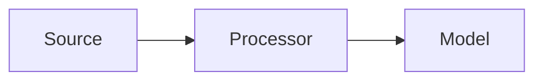
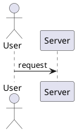

# Pattern Title

## Summary

Short one-paragraph summary of the pattern and when to use it.

## Problem

Describe the problem this pattern addresses.

## Context

When this pattern applies and key constraints.

## Solution

Describe the solution, steps, and rationale.

## Diagram (Mermaid)

## PlantUML

## Examples

Practical code snippets or configuration.

## References

Links and papers.

## Guardrails

Define the boundaries, constraints, and rules that govern the implementation and usage of this pattern to prevent misuse and ensure compliance with organizational standards.

## Monitoring

Specify how the pattern implementation should be monitored, including key metrics, logging requirements, alerting thresholds, and observability considerations.

## Governance

Outline the governance aspects of this pattern including ownership, approval processes, compliance requirements, and review cycles.

## Security

Detail security considerations specific to this pattern, including threat modeling, data protection, access controls, and security validation requirements.

## Testing

Describe the testing strategy for implementations of this pattern, including unit tests, integration tests, security tests, and performance tests.

## Reproducibility

Address how implementations of this pattern can be reproduced consistently across different environments, including configuration management, versioning, and deployment procedures.

## Lifecycle

Define the lifecycle stages of this pattern implementation, including creation, maintenance, evolution, and eventual deprecation procedures.

## Delivery Checklist

A checklist of items to verify before deploying implementations of this pattern:

- [ ] Security requirements met
- [ ] Monitoring and alerting configured
- [ ] Documentation complete
- [ ] Testing coverage achieved
- [ ] Performance benchmarks validated
- [ ] Compliance requirements satisfied
- [ ] Rollback procedures documented
- [ ] Disaster recovery plans updated
