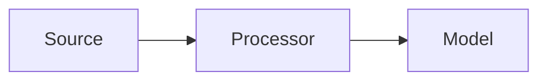
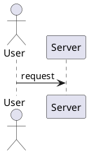

# Pattern Title

## Summary

Short one-paragraph summary of the pattern and when to use it.

## Problem

Describe the problem this pattern addresses.

## Context

When this pattern applies and key constraints.

## Solution

Describe the solution, steps, and rationale.

## System Architecture Considerations

Address how this pattern fits into broader system architecture patterns:

- Microservices: How does this pattern work in a containerized microservices architecture?
- Agent-Based: Does this pattern support multi-agent orchestration or shared memory systems?
- Event-Driven: How does this pattern handle asynchronous, event-driven processing?

## ML Pipeline Architecture

If applicable, describe how this pattern integrates with ML pipeline architectures:

- DAGs: How does this pattern fit into Directed Acyclic Graph workflows?
- Shared-Nothing: Does this pattern support horizontally scalable, independent processing?
- Parameter Server/Ring-AllReduce: How does this pattern handle distributed learning scenarios?

## Deployment Strategy

Detail the recommended deployment approach for this pattern:

- Online Serving: Is real-time inference appropriate for this pattern?
- Batch Serving: Is batch processing more suitable?
- Blue/Green: Would zero-downtime deployment be beneficial?
- Canary: Would progressive rollout reduce risk?

## Scalability Approach

Describe how this pattern scales:

- Horizontal: How does this pattern handle scaling by adding more instances?
- Vertical: How does this pattern utilize increased resources (CPU, memory, GPU)?
- Load Balancing: How should requests be distributed across instances?

## Data Handling

Address data-related aspects of this pattern:

- Feature Store: How does this pattern interact with centralized feature repositories?
- Data Versioning: How is dataset versioning handled?
- Stream Processing: Does this pattern support real-time data ingestion?

## Model Serving

If applicable, detail model serving aspects:

- Model Registry: How are model versions managed?
- Multi-Model Serving: Can this pattern serve multiple models efficiently?
- A/B Testing: How can variants be compared?
- Shadow Mode: Can new implementations be validated risk-free?

## MLOps Integration

Describe how this pattern supports MLOps practices:

- Continuous Training: How does this pattern handle automated retraining?
- Model Monitoring: What metrics should be tracked in production?
- Experiment Tracking: How are experiments recorded?
- Model Governance: How does this pattern ensure compliance?

## Infrastructure Requirements

Detail infrastructure needs:

- Distributed Systems: Does this pattern leverage distributed AI superfactories?
- GPU Resources: Are specialized compute resources required?
- Edge Deployment: Is edge deployment appropriate?

## Diagram (Mermaid)

## PlantUML

## Examples

Practical code snippets or configuration.

## References

Links and papers.

## Guardrails

Define the boundaries, constraints, and rules that govern the implementation and usage of this pattern to prevent misuse and ensure compliance with organizational standards.

## Monitoring

Specify how the pattern implementation should be monitored, including key metrics, logging requirements, alerting thresholds, and observability considerations.

## Governance

Outline the governance aspects of this pattern including ownership, approval processes, compliance requirements, and review cycles.

## Security

Detail security considerations specific to this pattern, including threat modeling, data protection, access controls, and security validation requirements.

## Testing

Describe the testing strategy for implementations of this pattern, including unit tests, integration tests, security tests, and performance tests.

## Reproducibility

Address how implementations of this pattern can be reproduced consistently across different environments, including configuration management, versioning, and deployment procedures.

## Lifecycle

Define the lifecycle stages of this pattern implementation, including creation, maintenance, evolution, and eventual deprecation procedures.

## Delivery Checklist

A checklist of items to verify before deploying implementations of this pattern:

- [ ] Security requirements met
- [ ] Monitoring and alerting configured
- [ ] Documentation complete
- [ ] Testing coverage achieved
- [ ] Performance benchmarks validated
- [ ] Compliance requirements satisfied
- [ ] Rollback procedures documented
- [ ] Disaster recovery plans updated
- [ ] Architecture alignment verified
- [ ] Scalability requirements addressed
- [ ] Data handling procedures defined
- [ ] MLOps integration confirmed
